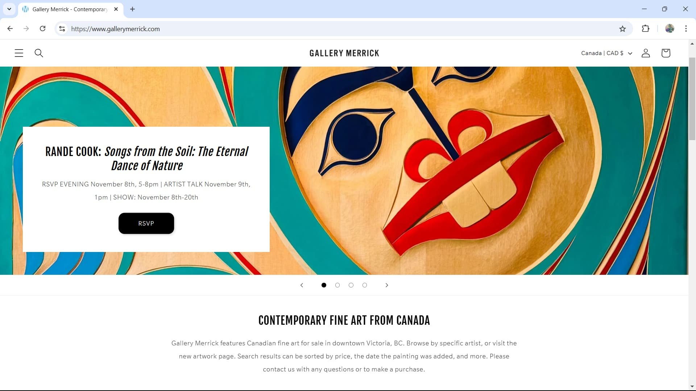

# Website Project Plan

## Project Summary

I am inspired to redesign the Pearl Ellis Gallery’s website: https://pearlellisgallery.com/

Just recently, I was exploring places to exhibit my work, and came across their social media feed. I overlooked them because their content looked dated and lacked charisma that would attract me to their space.

The main objective of the gallery is as follows, quoted from the about page:

> From the beginning, the object of the organization has been to establish and maintain an arts centre to promote interest in and study of the arts and to provide a location that affords a showcase for local talent.

The purpose of the Pearl Ellis Gallery is to attract and exhibit local talent, and to draw in the community to give and attend workshops. The target audiences are artists like myself, and art loving patrons and supporters in the Comox Valley.

Their overall message should convey that emerging artists are welcome here, and supporting the gallery is supporting the whole community through education, exhibitions and art sales. Pearl Ellis Art Gallery also provides a bursary of $1000 to a lucky student pursuing the arts, once a year.

Before the viewer leaves the site, they should at least see some local work in the gallery, contact them to sign up for a workshop or apply for an exhibit, or purchase a membership in support.

Some of the issues on the site that could be improved are as follows:

- Some of the gallery images are slow to load
- It’s visually text based and doesn’t showcase artist's work (too much text!)
- The hamburger menu and menu items have low contrast in the header
- The images of the gallery are taken from afar, have poor lighting, and do not show off the art in an accessible way
- There are too many CTAs that say “learn more,” without visuals
- There isn't a clear hierarchy on the site to drive the audience to take action
- The layout is designed with mobile in mind, but is poorly designed for laptop view, with long lines of text and disorganized section layouts in the footer
- Site uses many colors and doesn’t follow the 60-30-10 rule, or consistently use branding colors

## Look and feel

### Mood

In the redesign, I aim to make the site more visually pleasing. The mood should be welcoming and approachable with images showcasing their artists, events, and workshops. The site should have a clear, uncluttered rhythm and calls to action.

### Inspiration

**Here are 3 gallery sites to inspire:**

[The Kube, Gibsons, BC](https://thekube.ca/ "The Kube gallery home page")

[Gallery Merrick, Victoria BC](https://www.gallerymerrick.com/ "Gallery Merrick home page")

[Tofino Gallery of Contemporary Art, Tofino BC](https://tofinogalleryofcontemporaryart.com/ "Tofino Gallery home page")

### Colours

Pearl Ellis has a logo and brand colours I can use for their site. The problem is that the main colour they use is business blue, which is very conservative and kind of boring. I plan to use less of the blue colour and showcase the artwork as the secondary colour scheme. Text will be the dark blue, consistent with the logo, and the art work will be left to shine on the neutral white background, like gallery walls.

- Primary: dark blue hex 303a75 OR light blue hex 407aab
- Secondary (neutral): white hex FAFAFA or FFFFFF, since the logo isn't a vector
- Accent: purple hex 802d7e

### Fonts

As with many galleries, Pearl Ellis uses san serif fonts. The logo appears to be Neu Frutiger, which is very similar in style to Roboto. To maintain consistency with the branding I will use Roboto for headings and open sans for body copy.

---

## Pearl Ellis Gallery Webpage Plan

---

### Home page

**1. Header**

- Logo
- Main Navigation:
  - Home
  - Shows
  - Workshops
  - Contact
  - Artist Directory

**2. Hero Section**

- Image: High quality image of feature art work currently at the gallery
  - Heading: Welcome to your local gallery, connecting Comox Valley artists with art lovers.
  - CTA - “See Current Shows”

**3. About Section**

- Heading: “About Us”
- Paragraph: brief introduction to the gallery
  - Link: “Read more” on the about page

**4. Workshops Section**

- Image: members creating in the space
- Heading (right): Creative Workshops
- Paragraph: brief paragraph about workshops
  - CTA: "Sign Up Now"

Next row:

- Heading (left): Host a Workshop
- Paragraph: Brief call out to give a creative workshop
  - CTA: "Contact Us with your ideas"
- Image: Authentic image of workshop or craft tools on table.

**5. Artist Section**

- Heading: Show your work with us!
- Paragraph: Brief paragraph encouraging artists to apply for shows
  - CTA: “Apply to show”

**6. Footer**

- Map (left): Embedded Google Map
- Heading (right): "Land Acknowledgment"
- Heading (right, below): "Gallery Info"
  - Hours
  - Address
  - phone number
  - email.

Second footer

- Logo
- Social media links
- Privacy policy
- Copyright
- Disclaimer: "This is a fictional website designed and coded as an educational exercise."

---

### Shows Page

---

**1. Header**

- Same as home page

**2. Hero Section**

- Image: High quality image of feature art work currently or upcoming at the gallery
- Heading: Past, Present, and Future Shows
- Subheading: Explore our exhibits celebrating local artists.
  - CTA: "See Current Shows"

**3. Upcoming Show Section**

- Heading: "Upcoming Shows"
- Paragraph: Brief introduction to upcoming exhibitions
- List or grid of upcoming exhibitions including:
  - Thumbnail to medium sized images of each show
  - Title, dates, and short artist bio/description
  - **More info** button that would link to a more detailed page.

**4. Past Shows Section**

- Heading: See Our Past Shows
- Grid or slideshow:
  - Images of past shows with titles and dates
  - Each image could link to a page with images

**5. Artist Submissions Section**

- Heading: Submit Your Artwork to Exhibit!
- Paragraph: Brief paragraph encouraging artists to apply for shows
- Artist Submission Form
  - Form Fields:
    - Name (text input)
    - Email (email input)
    - Medium (text input or radio buttons)
    - Artwork image upload (file upload)
    - Short Artist Bio and statement (text area)
  - "Submit Your Work" button

**6. Footer**

- Same as home page

---

### Artist Directory Page Outline

---

**1. Header**

- Same as home page

**2. Hero Section**

- Image: High quality image of featured artist or gallery image
- Heading: Local Artists from the Comox Valley and Vancouver Island
- Subheading: Discover and connect with artists from our community
  - CTA: "Join Our Artist Directory" (leads to a contact form or submission instructions)

**3. About the Artist Directory Section**

- Heading: About Our Artist Directory
- Paragraph: Brief explanation about how the directory works and who can be included
- CTA: "Become A Member Today and Join the Directory" (leads to membership form)

**4. Artist Directory Table Section**

- Heading: Meet Our Artists
- Subheading: Browse through our featured artists and learn more about their work.
- Table:
  - Artist profile image
  - Featured artwork image
  - Artist name
  - Studio Name
  - Location
  - Medium: type of work they make
  - Contact info email or phone
  - Social Media tag

**5. Artist Directory Submissions Section**

- Heading: Ready to be featured?
- Subheading: If you're a local artist and would like to join our directory, send us your bio and artwork examples.
- CTA: "Submit Your Work for the Directory" (linked to contact form or email)

**6. Footer**

- Same as home page
